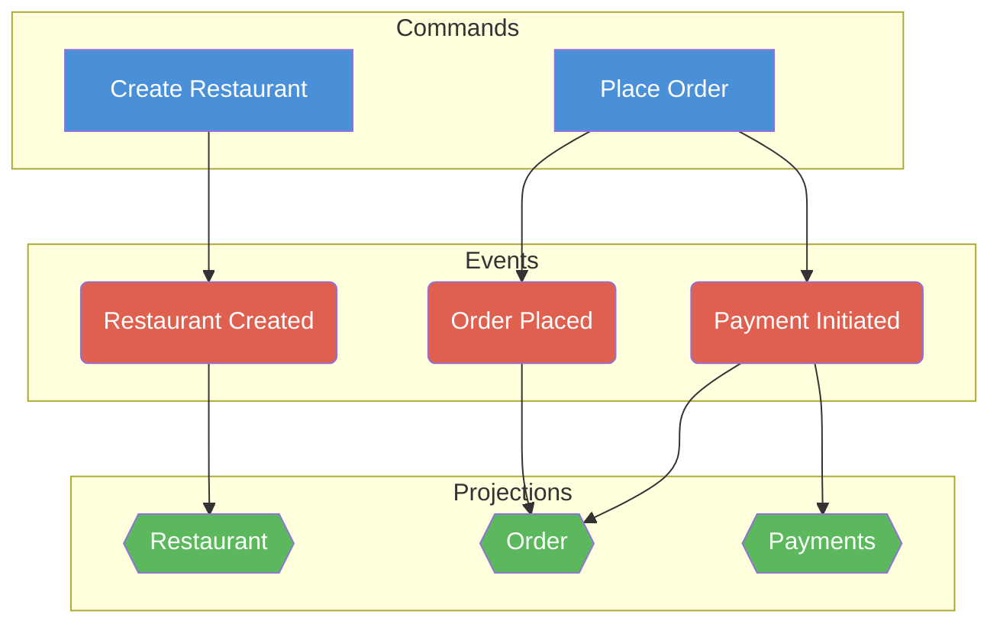

# Diagram to Table — Full Rules

## Input

A visual Event Model diagram containing:

- **Commands** (blue sticky notes)
- **Events** (red/orange sticky notes)
- **Projections** (green sticky notes)

Arranged on a timeline from left to right.

## Cell Types

- **C** — Command (blue)
- **E** — Event (red/orange)
- **P** — Projection (green)

## Layout Rules

1. **Row 1** contains Commands and Projections. Row 2+ contains Events.
2. **Commands** occupy row 1 in their column. Events produced by that command
   stack vertically below it (row 2, row 3, …).
3. **Projections** sit in row 1, to the right of the event column(s) they
   subscribe to — placed between the current command's events and the next
   command.
4. Each **Projection cell** lists the event cells it subscribes to in brackets,
   e.g. `P: Restaurant [A2, A3]`.
5. **All primitives (C, E, P) are identified by name.** Projections can repeat
   across the timeline — repeated occurrences refer to the same projection (e.g.
   `B1 = D1` when both are `P: Restaurant`).
6. When a **projection repeats**, it only lists the new event cell(s) from the
   immediately preceding command — earlier subscriptions are already captured in
   the previous occurrence.
7. **Event columns** under a projection are empty — projections never share a
   column with events.

## Relationships

- **Command → Event(s)**: vertical (same column, row 1 → row 2, 3, …)
- **Event(s) → Projection**: horizontal (event column → next projection column
  to the right)
- A single command can produce multiple events.
- A single event can feed multiple projections (multiple P columns to its right
  before the next C column).
- Different events from the same command can feed different projections.

## Formula Notation

```
# Cell definitions
<cell> = <type>(<name>)

# Command produces events (vertical, downward)
<command_cell> -> [<event_cell>, ...]

# Projection subscribes to events (horizontal, from left)
<projection_cell> <- [<event_cell>, ...]
```

## Full Example

### Table

|       | A                     | B                  | C                          | D                  | E              | F                          | G                  | H                            | I                         |
| ----- | --------------------- | ------------------ | -------------------------- | ------------------ | -------------- | -------------------------- | ------------------ | ---------------------------- | ------------------------- |
| Row 1 | C: Create Restaurant  | P: Restaurant [A2] | C: Change Restaurant Menu  | P: Restaurant [C2] | C: Place Order | P: Order [E2, E3, E4]      | C: Mark Order Paid | C: Mark Order Payment Failed | C: Mark Order As Prepared |
| Row 2 | E: Restaurant Created |                    | E: Restaurant Menu Changed |                    |                | E: Restaurant Order Placed |                    |                              |                           |
| Row 3 |                       |                    |                            |                    |                | E: Payment Initiated       |                    |                              |                           |
| Row 4 |                       |                    |                            |                    |                | E: Payment Exempted        |                    |                              |                           |

Note: This is a simplified representation. The actual table from the restaurant
demo has more columns for the remaining commands and their events.

### Formulas

```
A1 = C(Create Restaurant)
A2 = E(Restaurant Created)
B1 = P(Restaurant)
C1 = C(Change Restaurant Menu)
C2 = E(Restaurant Menu Changed)
D1 = P(Restaurant)                    # D1 = B1 (same projection)
E1 = C(Place Order)
E2 = E(Restaurant Order Placed)
E3 = E(Payment Initiated)
E4 = E(Payment Exempted)
F1 = P(Order)
G1 = C(Mark Order Paid)
G2 = E(Order Paid)
H1 = C(Mark Order Payment Failed)
H2 = E(Order Payment Failed)
I1 = C(Mark Order As Prepared)
I2 = E(Order Prepared)

# Command → Event relationships
A1 -> [A2]
C1 -> [C2]
E1 -> [E2, E3, E4]
G1 -> [G2]
H1 -> [H2]
I1 -> [I2]

# Projection ← Event relationships
B1 <- [A2]
D1 <- [C2]                            # D1 = B1, so Restaurant gets A2 + C2
F1 <- [E2, E3, E4]
```

## Mermaid Diagram Rules

1. **Direction**: `flowchart TD` — top-down
2. **Node shapes**:
   - Command → rectangle: `A1[Create Restaurant]`
   - Event → rounded: `A2(Restaurant Created)`
   - Projection → hexagon: `B1{{Restaurant}}`
3. **Edges**:
   - `->` formula → Command `-->` Event edge
   - `<-` formula → Event `-->` Projection edge
4. **Repeated projections** reuse the first node ID
5. **Three subgraphs** with `direction LR`: Commands, Events, Projections
6. **Node colors**:
   - Commands: `fill:#4A90D9,color:#fff`
   - Events: `fill:#E06050,color:#fff`
   - Projections: `fill:#5CB85C,color:#fff`

### Mermaid Example



## Edge Cases

- **Command with no projection**: events still appear in the table but have no
  P column to the right. This is valid — not all events need a read model.
- **Projection with events from multiple commands**: collect all `<-` formulas
  across the timeline for that projection name.
- **Single event feeding multiple projections**: multiple P columns between two
  C columns, each referencing the same event cell.
- **Command producing zero events**: valid but unusual. The command column has
  only row 1 filled.
